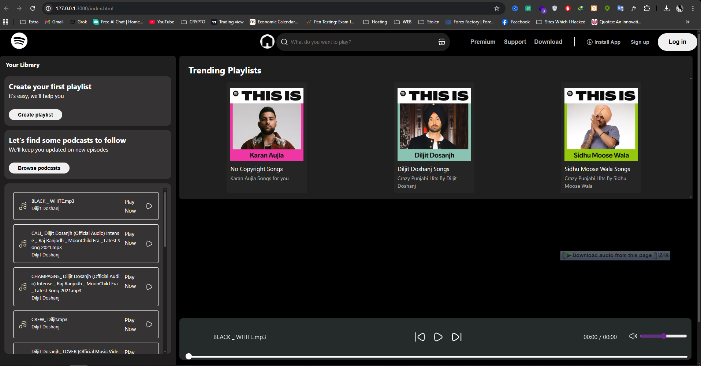

# 🎵 Spotify Clone

A simple **Spotify Clone** built with **HTML, CSS, and JavaScript** where you can easily **play songs** and explore playlists.  

---

## ✨ Features
- 🎧 **Play / Pause Songs** with a clean music player UI  
- ⏩ **Next / Previous Controls** to switch between tracks  
- ⏱️ **Progress Bar & Timer** to track playback time  
- 📂 **Directory Reading (Hardcoded)** – fetches songs directly from project folders  
- 📑 **Auto Playlist Detection**  
  - Each playlist folder contains:
    - `info.json` → Playlist information (title, description, author)  
    - `cover.jpg` → Playlist cover image  
  - The app **auto-detects and updates** based on folder contents  

---

## 🛠️ Tech Stack
- **HTML5**  
- **CSS3**  
- **JavaScript (Vanilla JS)**  

---

## 📂 Project Structure
Spotify-Clone/

│── index.html           # Main landing page  
│── style.css            # Main styling  
│── utility.css          # Utility classes for styling  
│── script.js            # Music player logic  
│── /songs/              # Song directories  
│   ├── Playlist1/  
│   │   ├── song1.mp3  
│   │   ├── song2.mp3  
│   │   ├── info.json  
│   │   └── cover.jpg  
│   ├── Playlist2/  
│   │   ├── song1.mp3  
│   │   ├── song2.mp3  
│   │   ├── info.json  
│   │   └── cover.jpg  

---

## 🚀 How It Works
1. The app **reads playlist folders** (hardcoded path).  
2. For each folder:  
   - Loads `info.json` to get playlist name & songs.  
   - Displays `cover.jpg` as playlist thumbnail.  
   - Adds available `.mp3` files into the player automatically.  
3. You can then **click on any song to play it** instantly.  

---

## 📌 Limitations
- Directory reading is **hardcoded**, so you must **manually add folders** inside `/songs/`.  
- Works only in environments where directory listing is supported.  

---

## 📸 Screenshots 

--- 

## 🎯 Future Improvements
- ✅ Dynamic directory reading (without hardcoding).  
- ✅ Search and filter songs.  
- ✅ User playlist creation.  
- ✅ Volume & shuffle controls.  

---

## 📜 License
This project is for **educational purposes only** and not affiliated with Spotify.  

---
